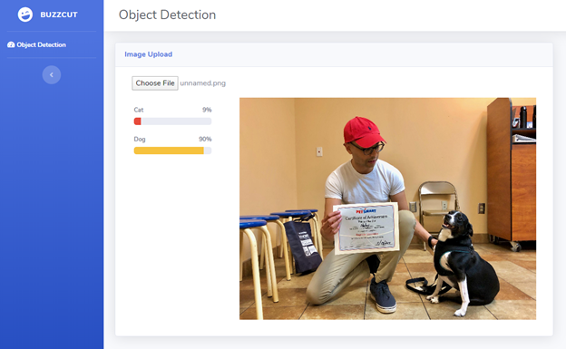

# Buzzcut

Buzzcut is a ML sandbox environment use to test adversarial attacks against vulnerable ML image classifiers. 

## Getting started
1. Clone the project to your local machine: `git clone https://github.com/angel-fontalvo/buzzcut.git`
2. Install <a href="https://www.npmjs.com/" target="_blank">NPM</a> 

## Usage instructions
1. Install the project's dependencies: `npm install`
2. Run the project locally: `npm run devstart`
The project will start on port 3000, it will fail if you have an already running process on that port. If there aren't any issues, your browser should open up automatically on http://localhost:3000/object-detection. 

## About the demo ML model
The project uses a default ML model trained to recognize images between cats and dogs. The model was trained using TensorFlow v1.14.0. 

